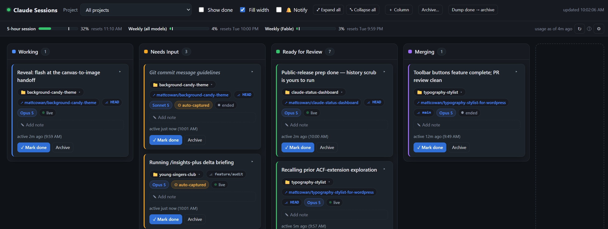

# Claude Session Status Dashboard

A local Kanban board that tracks the status of **every Claude Code session** across
all your projects — so when you have several sessions running at once you can see
at a glance which are working, which need you, and which are ready for review.

Open it at **http://127.0.0.1:4787**.



One **card per Claude session**, keyed by its session id and tagged with the
project folder it ran in. Cards move through columns automatically as sessions
work and stop; **you** decide when something is truly *Done*.

Reading the shot above: **Working / Needs Input / Ready for Review** are the
three fixed columns Claude itself moves cards between, **Merging** is a custom
one managed by hand, and **Done** is hidden behind a toggle. Each card carries
its project folder, git remote and branch, the model that did the work, and a
**⚙ auto-captured** badge where Claude stopped without declaring an outcome.

---

## How it works

- **Zero dependencies.** Pure Node (v18+); nothing to `npm install`. A single
  long-lived server process owns `data/board.json`, so many sessions writing at
  once never race.
- **Auto-starts itself.** The first-prompt hook health-checks the server and
  launches it (detached) if it's down — you never have to remember to start it.
- **Cards are created and moved by hooks + a tiny CLI:**

| Trigger | What happens |
|---|---|
| **First prompt** (UserPromptSubmit hook) | Creates this session's card in **Working**, tagged with the folder. Only fires once you actually send a message, so opening an empty chat never makes a ticket. |
| **Every prompt / Stop** | Refreshes the card's session metadata from the transcript: the **auto-generated session title** (same as the VS Code tab title — shown italic as the headline until Claude sets one), the plan **slug**, the **git branch** (⎇ badge, linked on GitHub repos), and the transcript path. |
| Claude runs `status.js set` | Sets the headline + description (stays **Working**). |
| Claude runs `status.js note` | Appends a bullet as the task sprawls. |
| Claude runs `status.js needs-input` | Deliberate hand-off → **Needs Input**. |
| Claude runs `status.js done-for-review` | Claude thinks it's ready → **Ready for Review**. |
| **Stop** hook (backstop) | If Claude left the card in *Working*, captures "where it left off" from the transcript, moves it to **Needs Input**, and flags it **⚙ auto-captured**. |
| **PostToolUse(Edit\|Write)** hook | Any file edited *outside* the project folder is listed on the card (⚠ external edits). |
| **SessionEnd** hook | Marks the session **ended** (live-dot turns grey). |
| You, in the UI | **Mark done**, **Archive**, **Restore**, or **Delete**. |

The **⚙ auto-captured** badge is the tell: it means the Stop backstop moved the
card because Claude didn't declare an outcome — as opposed to a deliberate
*Ready for Review*.

---

## Setup

Requires **Node 18+**. There is nothing to install — no dependencies, no build
step. Setup is three files you copy, and it matters that you do **all three**:
the hooks put cards on the board, and the `CLAUDE.md` block is what makes those
cards say anything.

```sh
git clone https://github.com/mattcowan/claude-status-dashboard.git
cd claude-status-dashboard
node bin/status.js ensure-server     # verify it starts, then open the URL it prints
```

Everywhere below, `<DASHBOARD_PATH>` is the absolute path to that clone.

### 1. Wire up the hooks *(creates and moves cards)*

Merge the four entries from [`examples/settings.hooks.json`](examples/settings.hooks.json)
into the `hooks` object of your `~/.claude/settings.json`, substituting
`<DASHBOARD_PATH>`.

> **Merge, don't replace.** Each event holds an *array* of hook groups and Claude
> Code runs all of them. If you already have a `Stop` or `UserPromptSubmit` hook,
> append to that array — pasting over it silently disables what you had.

Restart Claude Code, send a prompt in any project, and a card should appear.
If nothing shows up, see [Troubleshooting](#troubleshooting).

### 2. Add the `CLAUDE.md` block *(makes cards meaningful)*

Paste the block from [`examples/CLAUDE.md-snippet.md`](examples/CLAUDE.md-snippet.md)
into `~/.claude/CLAUDE.md` (every project) or a single project's `CLAUDE.md`.

**This step is not optional decoration.** Hooks can create a card, move it
between columns, and scrape a fallback summary from the transcript — but nothing
in a hook can know that Claude is "tracking down a rounding bug in the checkout
tax". Only Claude can say that, and it only says it because this block asks it
to. Skip this step and every card lands as an italic auto-title stamped
**⚙ auto-captured**, which is the board telling you the truth: nobody declared
anything.

It's worth reading as the design point of the project — the prompt is a
configuration file, sitting alongside the hooks rather than beneath them.

### 3. Install `/post-status` *(optional)*

Copy [`examples/commands/post-status.md`](examples/commands/post-status.md) to
`~/.claude/commands/post-status.md` and substitute `<DASHBOARD_PATH>`. Then
`/post-status` in any session posts an on-demand snapshot — useful for sessions
that were already open before you installed the hooks.

### Troubleshooting

| Symptom | Cause |
|---|---|
| No cards appear at all | Hooks not firing. Most often `node` isn't on the PATH that Claude Code hands hooks — replace `"command": "node"` with an absolute binary path (e.g. `C:/Program Files/nodejs/node.exe`, or the output of `which node`). |
| Cards appear but are all italic and **⚙ auto-captured** | Step 2 is missing. The hooks are working; Claude hasn't been told to write a status. |
| Cards appear for some projects only | A project-level `CLAUDE.md` is in play instead of the global one. |
| Port 4787 already in use | Another instance owns it (harmless — the server exits quietly). Change it with the `PORT` env var or by writing a number into `data/server.port`. |

---

## Running it manually

```sh
node server.js            # start the server (usually unnecessary — hooks do it)
node bin/status.js ensure-server   # start it only if not already running
node bin/status.js url    # print the dashboard URL
```

Port is `4787` by default; override with the `PORT` env var or by writing a
number into `data/server.port`.

## The CLI (what Claude calls)

```sh
node bin/status.js set --headline "Fix checkout tax rounding" --body "…"
node bin/status.js note --bullet "Reproduced with a 3-item cart"
node bin/status.js needs-input --body "Confirm whether the AJAX handler is public"
node bin/status.js done-for-review
```

**Session resolution** (so Claude rarely needs to know its id): `--session <id>`
→ the `CLAUDE_CODE_SESSION_ID` env var Claude Code exposes to Bash → the
most-recently-active non-done card whose project equals the current working
directory. If no card exists yet (e.g. a `/post-status` in a session that
predates the hooks), the CLI creates one.

## Hooks (installed in `~/.claude/settings.json`)

Copy-paste config: [`examples/settings.hooks.json`](examples/settings.hooks.json).

All four call this one script in **exec form** (the hook JSON arrives on stdin):

```jsonc
{ "type": "command", "command": "node",
  "args": ["<DASHBOARD_PATH>/bin/status.js", "<subcmd>"] }
```

| Event | Subcommand |
|---|---|
| `UserPromptSubmit` (appended after the existing hooks) | `hook-user-prompt` — creates the card on the first prompt that isn't skip-listed |
| `Stop` (appended after the existing hook) | `hook-stop` |
| `PostToolUse` matcher `Edit\|Write` | `hook-post-edit` |
| `SessionEnd` (appended after the existing hook) | `hook-session-end` |

(Card creation is on `UserPromptSubmit` rather than `SessionStart` on purpose:
`SessionStart` fires when a chat *opens*, which produced empty tickets for
sessions you never used.)

## Skipped prompts (commands that don't earn a card)

Some slash commands are bookkeeping, not work. `/git-commit-message` is the
motivating case: it's run inside an already-open, higher-tier session precisely
to avoid switching models just to draft a commit message. A session that only
ever does that isn't a task, so it shouldn't appear on the board at all.
`/git-review` — a read-only pre-commit gate over changes some other session
already made — is the same shape, and is skipped for the same reason. So is
`/pr-description`, which writes up a branch that some other session built. All
three describe work rather than do it.

`hook-user-prompt` checks the prompt against a **skip list** ([`lib/skip-prompts.js`](lib/skip-prompts.js))
*before* it contacts or spawns the server, so a session that only runs skipped
commands never even starts the dashboard. The check itself is one small file
read. A prompt that actually matches then writes its marker (see below), which
also sweeps the marker directory — a `readdir` plus a `stat` per marker. It is
all local file I/O either way: no HTTP, no server process.

Suppressing creation at this one point is sufficient, because every other hook
path — the Stop backstop, model/meta recording, external-edit tracking,
session-end — no-ops when the card is absent rather than creating one.

**Configuring the list.** There is one list, in one place. The shipped default
is `DEFAULT_COMMANDS` at the top of [`lib/skip-prompts.js`](lib/skip-prompts.js)
— currently `["git-commit-message", "git-review", "pr-description"]`. Add a
command there to skip it for every install.

To override it on one machine without touching the code, write a JSON array of
command names (leading slash optional) to `data/skip-prompts.json`:

```json
["git-commit-message", "git-review", "pr-description", "insights"]
```

That file **replaces** the default rather than adding to it, so repeat any
built-ins you still want skipped. It lives under the gitignored `data/`, which
makes it the right home for commands specific to your own setup — and means a
fresh clone falls back to `DEFAULT_COMMANDS`. A missing or malformed file also
falls back to the default rather than silently skipping everything (or nothing).

That fallback has no "off" switch, which is worth knowing before you reach for
one. A file that is well-formed but yields no usable names — `[]`, `[""]`,
`["  "]`, `["/"]`, `[0]` — is treated exactly like a missing one and restores
`DEFAULT_COMMANDS`; it does **not** turn skipping off. That is deliberate, so a
file that got truncated or emptied by accident can't silently put every
bookkeeping command back on the board. To genuinely skip nothing, empty
`DEFAULT_COMMANDS` in the source instead.

**What counts as a match.** The prompt must be the invocation and *nothing more* —
either the raw typed form on a **single line** (`/git-commit-message`,
`/git-commit-message --no-cosign`), or the expanded form Claude Code stores in
transcripts, where **every** line is a `<command-name>` / `<command-message>` /
`<command-args>` wrapper:

```
<command-message>git-commit-message</command-message>
<command-name>/git-commit-message</command-name>
```

Prose anywhere in the prompt means real work, even if a slash command appears in
it — a prompt that merely *quotes* `<command-name>/git-commit-message</command-name>`
(a code review of this very file, say) still gets a card. Anything the matcher
doesn't recognize — an unclosed tag, a wrapper Claude Code adds in future — also
falls through to "real work", which is the safe direction to fail.

### The `⤴ started late` badge

Skipping is per-*prompt*, not per-session, so a session can start with
`/git-commit-message` and then be given real work — usually by accident, since
the point of running it there was to *not* spend that model on the session. When
that happens, the card is created on the first real prompt and flagged:

- a purple **`⤴ started late`** badge on the card (hover for the count, which
  commands, and when the session actually began), and
- a history entry: *"Card created late — 2 earlier turns skipped
  (/git-commit-message)"*.

Without the flag, `createdAt` would quietly understate the session's real age.

Mechanically: each skipped prompt writes a small marker under
`data/skipped-sessions/<session-id>.json` (one file per session, so concurrent
sessions can't race); the first non-skipped prompt consumes it and passes the
count along on the card-creation POST. Markers for sessions that never came back
are swept after 7 days. The flag is only applied when that POST is what *creates*
the card — running `/git-commit-message` midway through an established session is
routine and gets no *started late* badge. It does get a command tag, below.

### Command tags — which sessions ran a skipped command

Skipped commands still say something useful about a session, even though they
never earn one a card: which sessions have been through the pre-commit gate,
which have had a commit message drafted, and which have had a pull request
written up. Cards carry a tag per command — **🔍 `/git-review`**,
**✎ `/git-commit-message`**, **🔀 `/pr-description`**, or **⌘ `/name`** for
anything else on your skip list — with a **×n** run count and the last run time
in the tooltip.

The **Command** filter narrows the board to sessions carrying a given tag, or to
*Ran any of these*. Its options come from the commands actually recorded on the
board rather than from a fixed list, so a third entry added to
`data/skip-prompts.json` appears there on its own; with nothing recorded yet, the
filter is disabled rather than offered as a control that does nothing.

A name only gets a tag if it looks like a slash command: up to 60 characters of
letters, digits and `. _ - : + /`, starting with a letter or digit. That covers
the shapes commands really take (`git-review`, `plugin:skill`,
`frontend/deploy`) and keeps whitespace, markup and pasted text out of
`board.json`, where these names are stored as keys. Both recording paths apply
the same rule, so a name cannot work before the card exists and then silently
stop working afterwards.

Two paths feed a tag, and the difference matters for the counts:

- **Runs on an established card** are reported live. `hook-user-prompt` posts to
  `/api/hook/skipped-command` *without* `ensureServer()` — the point of a skipped
  prompt is that it never starts the dashboard, so when nothing is listening the
  request fails fast and the tag is simply lost. The endpoint never creates a
  card either: it tags one already on the board, or does nothing. Recording a tag
  deliberately does **not** bump `lastActiveAt`, for the same reason a model
  reading doesn't — drafting a commit message is not the session doing work, and
  bumping the clock would reorder the board and strip the 💤 badge off a session
  that really has gone quiet. Only the first run of each command writes a history
  entry, so a session that drafts six commit messages doesn't bury its own log.
- **Runs from before the card existed** arrive with the *started late* marker
  described above. That marker keeps one count across *all* skipped commands in
  the session, not a tally per command, so it can only prove a given command ran
  at least once — those tags read **×1+** rather than claiming an exact figure.

## The `/post-status` command

Run **`/post-status`** inside any Claude session to make it post its current
status to the board on demand (handy for sessions that were already running
before the hooks existed, or any time you want an up-to-the-moment snapshot).
It's a custom slash command at `~/.claude/commands/post-status.md` — ship it from
[`examples/commands/post-status.md`](examples/commands/post-status.md). The session
summarizes its work, picks Working / Needs Input / Ready for Review, and posts via
the CLI. Add a note inline, e.g. `/post-status blocked on the staging DB creds`.

(Named `post-status` rather than `status` deliberately — Claude Code has a
built-in `/status`, so a custom `status` command would collide with it.)

## Usage limits strip

The bar under the header shows your Claude subscription usage — the 5-hour
session window, the weekly all-models window, and any per-model weekly windows.
Buckets are **discovered dynamically** from the response, so when Anthropic
changes the definitions (Opus-only week, Sonnet-only week, …) the strip follows
without code changes.

Each meter carries a small **pace marker** — a tick showing where usage *would*
be if it were spread evenly across the window (`elapsed / window length`). If the
fill sits left of the tick you're **under pace**; right of it (tick turns red)
you're **on track to exceed** before the reset. Hover any meter for the exact
numbers ("Even pace ≈ 54% by now · you're at 52% (on pace)"). The window length
is inferred from the bucket kind (5 hours for the session, 7 days for weekly);
an unrecognized bucket simply shows no marker.

**Color follows pace, not the raw percentage** — a number on its own says little,
since 70% used is fine 80% into the window and alarming 20% in. Meters stay green
while at or under pace, turn amber once usage runs more than 2 points ahead of
pace (a small deadband, so a meter sitting right on the tick doesn't flicker),
and go red only when ahead of pace *and* at 90% or more — within 10 points of the
cap. So a high-but-on-track meter
stays green, while a session that burns 30% in its first 15 minutes goes amber
immediately. (A bucket with no known window length has no pace to compare against
and falls back to fixed 60% / 85% thresholds.)

Under **Windows Forced Colors / high-contrast**, the meters redraw with system
colors (track outline + marker in `CanvasText`, fill in `Highlight`) so the bar
and pace tick stay visible — the color coding is replaced by the tick position
and the % text, which carry the same meaning without relying on hue.

- **Where it comes from:** Anthropic's **undocumented** OAuth usage endpoint,
  authenticated with the same token Claude Code already stores in
  `~/.claude/.credentials.json`. It may change or break without notice (the ⓘ
  in the strip says the same); failures degrade to a stale/error note, never a
  crash. A response the normalizer doesn't recognize is dumped to
  `data/usage-last-raw.json` so `lib/usage.js` can be recalibrated against it.
- **When it refreshes:** whenever a session pings the dashboard (throttled to
  once per 5 min), or via the strip's **↻** button (30s floor). Background
  polling on a timer exists but is **off by default** — enable it in the strip's
  **⚙** settings (persisted server-side in `data/settings.json`).
- If the token has expired, the strip says so; opening any Claude Code session
  refreshes it.

## Live updates & notifications

- The board listens on **SSE** (`/api/events`) and re-renders the moment a hook
  fires; polling (3s) remains as a fallback and slows to a 15s heartbeat while
  SSE is healthy.
- **🔔 Notify** (topbar) sends a desktop notification when a card *enters*
  **Needs Input** or **Ready for Review** — only for changes that happen while
  the tab is unfocused, and only after you opt in (permission is requested from
  the toggle, never on load).
- Cards idle for 10+ minutes (and not ended) get a **💤** badge with the
  relative time — an at-a-glance "this one's waiting on someone."

## Session state: live / idle / ended

Every card on the board carries one of three state badges. Only one of them is
a fact:

| Badge | Meaning |
|---|---|
| 🟢 **live** | Activity within the last 4 hours. The dot pulses. |
| 🟠 **idle** | Quiet for 4+ hours with no end signal. May still be open, may be long gone — we can't tell. No pulse. |
| ⚪ **ended** | The session's `SessionEnd` hook fired. Definitive. |

`ended` is written by the `SessionEnd` hook, which is reliable but **not
guaranteed** — a session lost to a crash, a reboot, or a force-quit never fires
it. So the absence of an end signal cannot be read as "still running." Earlier
versions did read it that way, and cards sat there claiming **live** for days.

**This is a longer threshold than the 💤 badge's, on purpose.** The two answer
different questions. 💤 (10 minutes, `STALE_MS`) asks *is this waiting on
someone?* — that's an attention signal, and ten minutes is the useful answer.
live/idle (4 hours, `IDLE_MS`) asks *is this session alive at all?*, where ten
minutes of thinking proves nothing. So a card can read **💤 20m** and **live**
at the same time; that isn't a contradiction, it's "awake, and waiting for you."
Both constants are at the top of [`public/app.js`](public/app.js).

A card with a missing, unparseable, or future-dated `lastActiveAt` reads `idle`
rather than `live` — with no trustworthy clock, "alive" is not a claim the board
can make.

**Filtering.** The **Session** dropdown in the topbar filters the board to one
state (or *Any state*). It's applied client-side, so it re-evaluates against the
clock on every render — a card ages out of *Live* on its own without a
round-trip — and the choice persists in `localStorage`. When it hides anything,
the topbar says how many, so a filtered board never reads as an empty one.

## Plan & transcript on the card

Expanded cards link to the artifacts behind the session: **📄 Plan** opens the
plan file Claude Code wrote for that session (`~/.claude/plans/<slug>*.md`) in a
modal, and the transcript path is shown with a **📋** copy button.

## The 📁 badge: session folder actions

The badge shows the friendly project label, with the session's **full working
directory** in its tooltip. Clicking it opens a small menu with the path in full
plus three actions:

- **📂 Open in Explorer** — `POST /api/cards/:id/open-folder`. The server (same
  machine) shells out to `explorer.exe` (`open` on macOS, `xdg-open` on Linux).
  A browser cannot navigate from an `http://` page to a `file://` URL, so this
  round trip is the only reliable way to open the real folder window.
- **🧩 Open in VS Code** — a plain `vscode://file/…?windowId=_blank` link. Custom
  schemes *are* handed to the OS from a web page, so this needs no server call.
  `windowId=_blank` is what forces a **new** window; without it VS Code's
  protocol handler reuses the last active one and replaces what you were looking
  at.
- **📋 Copy path** — the working directory to the clipboard.

**Every write is gated.** Any request that is not a `GET` must carry an `Origin`
this dashboard recognizes (its own loopback origin, or none at all) *and* a
loopback `Host`. The API has no auth — it is a local board — so those two
headers are what stands between it and a page on another origin. A browser
cannot forge `Origin`; a DNS-rebinding page resolving to `127.0.0.1` still sends
its own name in `Host`. Two callers get through: this dashboard's own page, and
a non-browser client (the CLI and the hooks), which sends no `Origin` at all.

The gate is one check at the top of the API router rather than a condition
repeated per route, so a new write endpoint is covered the day it is added.
It lives in [`lib/origin.js`](lib/origin.js) as a pure function of the two
headers, so [`test/origin.test.js`](test/origin.test.js) can exercise it without
standing a server up.
That matters, because it started life guarding only open-folder — on the
reasoning that launching a process deserved more care than "mutating board
data" — and the data endpoints turned out to include `DELETE /api/cards/:id`
and `/api/archive-done`. A cross-origin form `POST` reaches those without a
preflight, because a "simple request" with `Content-Type: text/plain` still
parses as JSON. Losing a card is not less bad than opening a folder.

open-folder keeps its extra restriction on top of the gate: the path comes only
from the card record, never from the request body, so it can only ever open a
folder already on the board.

## Sorting the board

**Sort** in the header sets the order of the cards. One order applies to every
column, so a card's position means the same thing wherever it is. Choose the
date to order by, then press the button beside it to reverse the direction.

- **Last active** — the last time the session did something. This is the
  default.
- **Started** — when the session began. For a session that ran a bookkeeping
  command first, this is the earlier "session began" time, not the time the
  card appeared. See *The ⤴ started late badge* above.
- **Last updated** — the last time the status changed.
- **Session ended** — when the session ended.

The button shows the direction in use — **Newest first** or **Oldest first** —
and its tooltip says what the next press does.

A card with no date for the chosen sort goes to the bottom of its column, in
both directions. **Session ended** is the sort where this happens most: it is
empty for every session that still runs, and oldest-first must not bury the
live cards under the finished ones.

Sorting is a display choice, not a filter, so **↺ Reset filters** leaves it
alone. Both the date and the direction are remembered between visits. The sort
acts on the board only: the **Archive** view keeps its own order, and the
**Projects** table has its own sort.

You can still drag a card to a different column while a sort is active. Where
the card lands depends on the sort. A move counts as activity, so it sets both
**Last active** and **Last updated** to now: under either of those the card
goes to the top of its new column, or to the bottom with oldest first. Under
**Started** and **Session ended** the dates do not change, so the card takes
the place its own date gives it.

## Views: Board, Projects, Archive

The three views are tabs in the header, not three panels that hide each other.
It is a real `role="tablist"`, so it behaves the way a tab set is supposed to:

- **Arrow keys** move between tabs and wrap; **Home** and **End** jump to the
  first and last. Activation follows focus, so arrowing to a tab opens it.
- **Tab** leaves the group in one press. Only the selected tab is in the page's
  tab order (a roving `tabindex`), so the tablist is one stop rather than three.
- A screen reader announces "Projects, tab, 2 of 3" and ties each panel to the
  tab that owns it (`aria-controls` and `aria-labelledby`). `aria-selected` says
  which view you are in, so the answer does not depend on seeing a colour.
- Each tab carries a count. **Board** is the number of cards actually rendered —
  after *Show done* and both filters — while **Projects** and **Archive** are
  whole-store totals that ride along on the board fetch, so neither view has to
  be open for its count to stay current.

The header is two rows. The top row holds the tabs and the controls that mean
the same thing everywhere: **Dump done → archive**, **Notify** and the refresh
clock. **Dump done → archive** sits there because it acts on the stored cards,
not on what the board is drawing, so it works from any tab — and from
**Archive** you see the result arrive. That is also why it asks first when
your filters hide part of what it will sweep: the filters are on the second
row, which is hidden on those tabs, so what the button will take is not on
screen. The second row holds the board filters and the sort, and it is hidden
outright on the Projects and Archive tabs rather than left sitting above a
view it cannot filter. Both rows are inside the one sticky header, so the
filters travel with the tabs.

A **skip link** (first Tab stop) jumps past the whole header to the current
panel. Your last tab is remembered.

## The Projects view

The **Projects** tab shows one row per project folder any
session has ever run in — the board **and** the archive, which is the point:
the board can only tell you what is in flight, while this answers what you have
worked on and when you last touched it. Rows are keyed by normalized path, so
two sessions that recorded the same folder with a different drive-letter case or
slash direction fold into one row.

Each row carries:

- the project label, with the same **📁 folder menu** the cards use (Open in
  Explorer / Open in VS Code / Copy path). "Open in Explorer" is pointed at the
  project's most recent card, so the path still comes from a stored record and
  never from the request body;
- the total session count, split into *on board / done / archived*;
- the most recent session's headline and where that card sits now;
- when it was last active;
- **git links** — the repo (↗) and the branch (⎇), linked on GitHub remotes. The
  repo URL is taken from the most recent card that *has* one rather than simply
  the most recent card: a session opened in a sub-folder may never have resolved
  a remote, and blanking the row over that would drop a working link.

There is no *Commands* column. The per-project command tags said less than the
Board tab's **Command** filter already says per session, and they used the width
that the project path and the last headline need.
(`/api/projects/summary` still returns the counts; this view does not show
them.)

**Search.** The **Search** box above the table filters the rows as you type. It
matches the project name and the full path, so `wamp` finds a project by where
it is on disk when you cannot remember its name. The line beside the box gives
the result — "13 of 30 projects match “wamp”, 45 sessions" — so a short table is
never mistaken for a short history. Press **Escape** to clear the box. The
search is not remembered between page loads: it is a search, not a setting, and
a restored query would hide rows for a reason nothing on screen explains.

**Sorting.** Click **Project**, **Sessions** or **Last active** to sort by that
column. Click the same header again to reverse it. The first click on a column
uses the useful end of it: names go A→Z, counts and dates lead with the largest
and the newest. A caret in the header shows the direction, and the column *and*
the direction are both remembered.

The table scrolls inside its own box (header pinned) so a long list or a wide
path never makes the page scroll sideways. Hover the **Last active** cell for
the exact times, including when the project's first session ran.

## Platform support

Developed on **Windows 11**; the core board (hooks, CLI, columns, SSE, plans,
transcripts) is plain Node and platform-neutral. Four things are not fully
portable yet, all of them non-fatal — each degrades to a message rather than a
crash. Reports welcome.

- **The usage strip needs a credentials *file*, which macOS may not have.** It
  reads the OAuth token from `~/.claude/.credentials.json`. That's where Claude
  Code keeps it on **Windows and Linux**, but on **macOS** it defaults to the
  system **Keychain** and the file may not exist — in which case the strip just
  reports a token error. Claude Code does support a file-based fallback in the
  same JSON format; if you have one, point this at it with the `CLAUDE_CRED_FILE`
  env var. The rest of the board is unaffected.
- **`CLAUDE_CONFIG_DIR` is not honored.** Both the credentials lookup above and
  the **📄 Plan** viewer assume `~/.claude/…`. If you've relocated your Claude
  Code config, plans won't be found; `CLAUDE_CRED_FILE` covers the credentials
  half only.
- **Path comparison is Windows-shaped.** `normalizePath` folds separators to `\`
  and lowercases, which is right on Windows and harmless on macOS's default
  case-insensitive volume, but on a **case-sensitive filesystem** two genuinely
  distinct paths differing only in case would be treated as one project.
- **Opening a folder** shells out to `explorer.exe` / `open` / `xdg-open`. The
  first two are verified; `xdg-open` is untested.

## Data & files

```
server.js            HTTP server (REST API + static UI + SSE)
lib/config.js        port / paths
lib/store.js         in-memory board + atomic debounced save + label logic
lib/transcript.js    transcript extractors (last message, model, title/slug/branch)
lib/usage.js         usage-limits fetcher + tolerant normalizer (undocumented API)
lib/settings.js      server-side settings (data/settings.json)
lib/skip-prompts.js  the skip list (commands that don't earn a card)
lib/origin.js        the Origin + Host gate on every write
bin/status.js        the one CLI (hooks + Claude subcommands + ensure-server)
public/              index.html, app.js, styles.css  (self-contained UI)
examples/            hook config, CLAUDE.md block, /post-status command (setup)
data/                board.json, archive.json, settings.json, usage.json,
                     skip-prompts.json, skipped-sessions/,
                     server.port/pid/log  (runtime, gitignored)
```

- **Active** cards live in `data/board.json`; **archived** (dumped) cards move to
  `data/archive.json`. Both are plain JSON you can inspect or back up.
- Writes are atomic (temp file + rename) and debounced, and a corrupt file is
  backed up rather than lost.

## Notes

- Loopback only (`127.0.0.1`) — not exposed to your network.
- The board updates live via SSE (with polling as fallback); drag cards between
  columns or use the buttons.
- "Done" is hidden by default (toggle **Show done**); **Dump done → archive**
  moves all done cards into the Archive view for long-term keeping. It sweeps
  the **whole store** — every done card, in every project — whatever the board
  is filtered to. It asks first when a **Project**, **Session** or **Command**
  filter hides part of that sweep. It then gives the true number and says how
  many of them your filters cover. A filter that already covers every done
  card hides nothing, so it stays one press — as it does with no filter on.
- The **Project** filter is a type-to-search box, not a plain dropdown. Click it
  (or press ↓) to see every project; type any part of a name or a path to narrow
  the list. ↓ and ↑ move through the matches, **Enter** applies one, **Escape**
  closes the list and puts the current project back in the box.
- **↺ Reset filters** clears the **Project**, **Session** and **Command**
  filters in one press. It does not touch **Show done**, **Fill width** or which
  cards are expanded — those are display choices, not filters. The button says
  how many filters are active in its tooltip, and reports "No filters are
  active" rather than going dead when there is nothing to clear.
- The count beside each project in the **Project** filter is that project's
  cards on the board, and it follows the **Show done** toggle: with Done hidden
  it stops counting finished cards, which used to make the list overstate
  the work in flight. It tracks that toggle and nothing else — the *Session* and
  *Command* filters are applied to the cards already fetched, and once a project
  is selected those are only that project's cards, so there is nothing to
  compute the other projects' filtered counts from. The **Board** tab's count is
  the post-filter figure. A project whose cards are all done stays in the list
  with a count of **0** rather than disappearing — otherwise ticking **Show
  done** would leave nothing to select.

### Custom columns

**Working / Needs Input / Ready for Review** are the three fixed "root" columns
Claude uses; **Done** is always pinned last (hidden by default). You can add your
own columns in between — e.g. a **Merging** column you manage by hand:

- **＋ Column** in the header adds one (auto-assigned a color). Hover a column
  header for its controls: **‹ ›** reorder, **✎** rename, **×** delete.
- Custom columns are **yours only** — Claude never moves cards into them, and the
  Stop backstop won't touch a card you've dragged into one. Reorder any column
  freely (Done stays last).
- **Deleting a custom column that still holds cards** asks what to do with them:
  move them to another column, or archive them all.

---

## A note on your data

Everything stays on your machine — the board binds to `127.0.0.1` and the only
outbound request is the usage-limits fetch to Anthropic's own API.

Be aware of what accumulates in `data/`, though: `board.json` and `archive.json`
hold the headline, description and "where it left off" text for **every session
across every project**, plus working directories and transcript paths. On
client work that is very likely confidential. `data/` is gitignored and should
stay that way — don't commit it, and treat it like a work journal if you back it
up or sync the folder.

## License

MIT — see [LICENSE](LICENSE).
